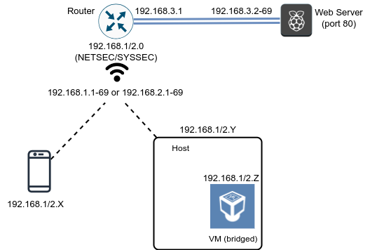

# Exercises: Network Layer Security

WARNING: iPhones fail at the multiple gateway step, so consider removing the ARP spoofing part and make it about routing only.

There are some hints and troubleshooting information [in this page](hints.md). Make sure to check it if you have problems or if you are running a native enrivonment without support to virtualization (such as an ARM-based Mac). 

## Preliminaries

You should begin by installing required dependencies. Make sure you have the Wireshark setup as described last week working with a VM in bridged mode.

### Ubuntu 22.04 Virtual Machine

```
sudo apt install mitmproxy
```

### WSL

At the time of writing, mitmproxy or ARP spoofing do not play well with the WSL virtualized network interface. Install native versions of [mitmproxy](https://downloads.mitmproxy.org/10.2.2/mitmproxy-10.2.2-windows-x86_64-installer.exe) and an [ARP spoofer](https://github.com/alandau/arpspoof).

### Network Layout

Our network will be slightly more complicated than the previous one. Instead of having all nodes connected to the same local network, we will keep `NETSEC` and `SYSSEC` as wireless networks, and segment the wired network to `192.168.3.0/24`. Now the Access Point (AP) serves as the _router_ between the wireless and wired networks. We will abstract the Web server running on a Raspberry Pi in the wired network on an addreess in range `192.168.3.2-69` as some Internet-facing server. A basic layout of the network is pictured below.



Connect to one of the wireless networks using the host system (you know the password) and test that you can connect to `http://192.168.3.2/` using a Web browser.
The traffic between your browser and the server is now being routed by the AP.

Start the VM and make sure that you can `ping 192.168.3.2` and access the HTTP address above in the VM, so you verify that the interface is functional in bridged mode.

## Exercise 1: ARP Spoofing against router

Connect a mobile device to the wireless network and take note of its address, referred from here on as `mobile`.
Select one of the addresses in the range `192.168.3.2-69` (which will be called `X` from now on).
Try to impersonate the Web server by running the ARP spoofing attack inside the VM:

```
sudo arpspoof -i <interface> -t <mobile> 192.168.3.X
```

Contrary to the last session, you can still access the Web server `http://192.168.3.X/` in your mobile. This is possible because ARP spoofing is ineffective here, since ARP does not resolve in the network `192.168.3.0` to which packets are _routed_. This will also have the side-effect that traffic directed towards `192.168.3.X` will be passed to the VM through the link layer and fix an [issue with VirtualBox](https://security.stackexchange.com/questions/197453/mitm-using-arp-spoofing-with-kali-linux-running-on-virtualbox-with-bridged-wifi).
However, we can still impersonate the router.

**Observation**: If accessing `192.168.3.X` fails, try to disable your mobile Internet access. Your phone might be trying to use that as the router. If you do not have a mobile device available, ask a colleague to be the client or use the host machine as the victim.

Choose randomly one address in the IP range `192.168.1.1-69` or `192.168.2.1-69` (depending if you are connected to `SYSSEC` or `NETSEC`) and manually configure this address as the gateway in your mobile device. You can use the same IP address you received before from DHCP for your mobile device. Now run the ARP spoofing attack below:

```
sudo arpspoof -i <interface> -t <mobile> <gateway>
```

You will notice that connectivity between the mobile device and the Web server might stop, since traffic will be redirected to the VM and not be routed further.

If you are running native Windows, you should run instead:

```
arpspoof.exe <gateway> <mobile>
```

In the case of Windows, `arpspoof.exe` takes care of the routing, so you can skip to the part of running `mitmproxy`.

## Exercise 2: Restoring access

Let's change the configuration for traffic to be forwarded again to the Web server.
The following configurations need to be performed in the VM to enable IP forwarding such that the VM can forward IPv4 traffic while avoiding ICMP redirects:

```
$ sudo sysctl -w net.ipv4.ip_forward=1
$ sudo sysctl -w net.ipv4.conf.all.send_redirects=0

```

After these configurations are put in place, the mobile device will be able to connect again to the Web server.
Start Wireshark in the VM to check that the traffic is still intercepted there. You can use the Login option to enter credentials and observe that they are captured by Wireshark, proving that the traffic is redirected to the VM.

## Exercise 3: Running mitmproxy

Wireshark will capture traffic and demonstrate the power of a passive eavesdropping attacker. Let's mount a more powerful attack.
We will run `mitmproxy` in the VM to be able to perform some processing of the captured traffic. First, configure the `iptables` firewall to send all HTTP traffic captured at port 80 in the VM to port 8080 under control of `mitmproxy`:

```
$ sudo iptables -A FORWARD --in-interface <interface> -j ACCEPT
$ sudo iptables -t nat -A PREROUTING -i <interface> -p tcp --dport 80 -j REDIRECT --to-port 8080
```

Now run `mitmproxy` in _transparent_ mode:

```
$ mitmproxy --mode transparent --showhost
```

If everything is working correctly, you should try again to access the Web server `http://192.168.3.X/` in your mobile device and start seeing captured flows in the `mitmproxy` window.
In this window, you can select a flow by using the arrows and pressing ENTER, while pressing the letter `q` goes back to the overview screen.

## FALLBACK: Running in proxy mode

If everything above fails, we can try a simple configuration that depends on the client forcing the traffic to pass through the adversary. This is not realistic for an attack in the local network, but it captures an attacker in a privileged network position.

Run `mitmproxy` in _proxy_ mode:

```
$ mitmproxy --showhost
```

Now manually configure the address of the machine running `mitmproxy` (port 8080) as the proxy in your mobile. All the HTTP traffic should now be captured by `mitmproxy` by definition.

## BONUS: Manipulate traffic

If you reached here we have a bonus round for you. For this last exercise, we will simplify our setup to remove ARP spoofing.
Configure the gateway in your mobile device to point directly to the IP address of the VM and stop the execution of the `arpspoof` program.

Let's use the scripting capability of `mitmproxy` to mount an _active_ attack.
Our simple website has a login capability, for which the credentials are `admin`/`admin`.

Now access the website through your mobile device with the right credentials and login. You should now be able to access the `View Secrets` and `Upload Secrets` functionalities.
The `View Secrets` functionality will just show you some secret text, which should be visible in `mitmproxy` as well.
The `Upload Secrets` functionality is more interesting and allows the user to encrypt a message under a public key returned by the server.
Your final task is to _replace_ that public key with a key pair for which you know the private key (to be able to decrypt).
The code for the server portion is provided for reference in the repository inside the folder `simple-website`.

In order to achieve your goal, generate an RSA key pair in PEM format and plug the values marked as TODO in the file `simple-website/mitm_pk.py`. Now restart `mitmproxy` with the command below:

```
$ mitmproxy --mode transparent --showhost -s mitm_pk.py
```

Recover the message from the encryption provided by the client.
